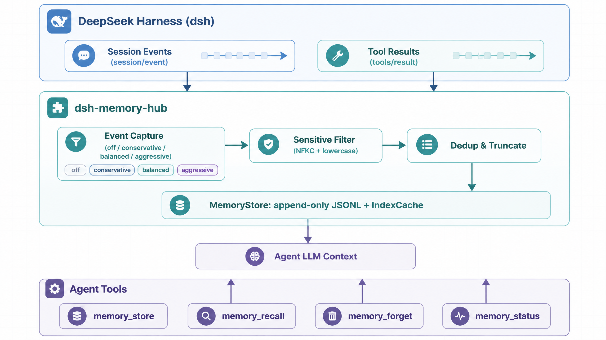
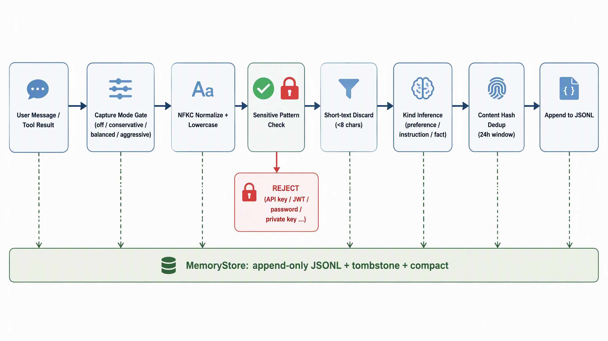
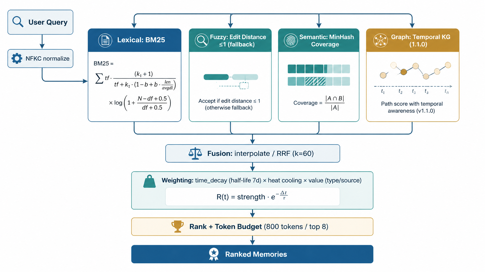
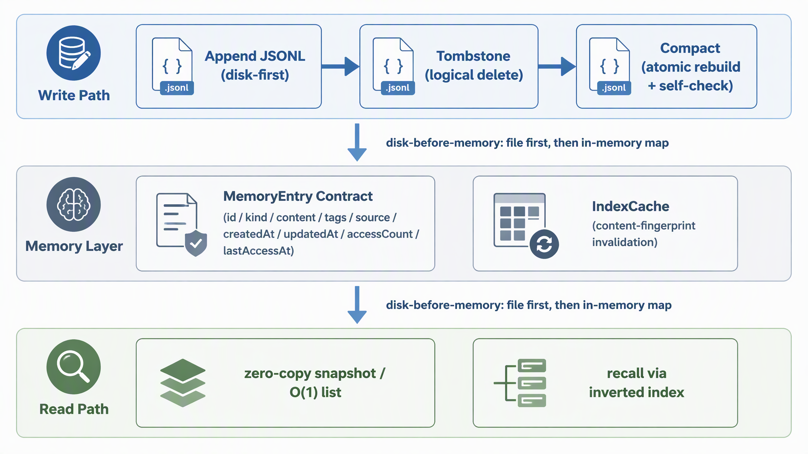
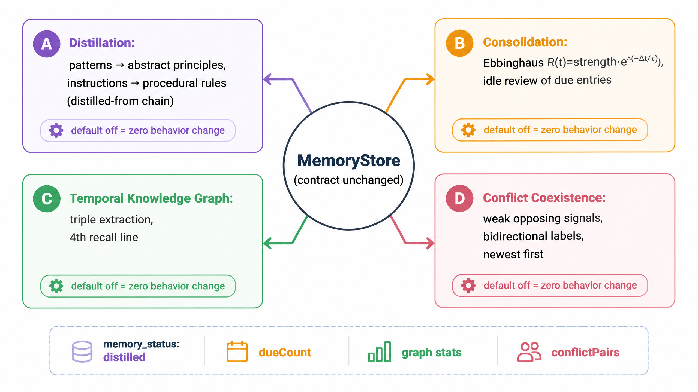

# dsh-memory-hub

**[简体中文](README.md) | [English](README.en.md)**


> **DeepSeek Harness Intelligent Session Memory Hub** — Make Harness understand you better over time.

`dsh-memory-hub` is a **local-first, event-driven** cross-session memory plugin for DeepSeek Harness (dsh). It automatically captures user preferences and tool-execution conclusions from conversations, and exposes 4 explicitly callable tools to agents. New sessions no longer start "from scratch".

- **Zero external services**: memories are stored only in local JSONL files — pure TypeScript, no third-party storage, no cloud dependency;
- **Event-driven automatic capture**: distills memories from the dsh event-sourcing layer (`session/event` pipeline) and the tool-execution pipeline (`tools/result`), with four configurable capture intensities;
- **Explicit agent tools**: `memory_store` / `memory_recall` / `memory_forget` / `memory_status` — the model reads and writes memory as needed;
- **Privacy & security by default**: API keys, passwords, JWTs, private keys, database connection strings and other sensitive patterns are always intercepted and never stored; capture only targets real user input, skipping plugin injections and subagent contexts.

> Why "an unclaimed niche": the official v0.2 release notes list "adding personalized long-term memory" as a future direction; existing community memory plugins are early-stage / unvalidated / dependent on external ecosystems. See [`docs/ARCHITECTURE.md`](docs/ARCHITECTURE.md) for the full differentiation argument.

---

## System Overview

<div align="center">
  
  <br/>
  <sub><b>Fig. 1</b> Overall architecture: dsh events & tool results → capture & filtration → append-only local memory store → four tools feed the agent context</sub>
</div>

## Table of Contents

- [Features at a glance](#features-at-a-glance)
- [Capture pipeline](#capture-pipeline)
- [Installation](#installation)
- [Configuration](#configuration)
- [Tool usage guide](#tool-usage-guide)
- [Recall quality design](#recall-quality-design)
- [Architecture highlights](#architecture-highlights)
- [Storage & consistency model](#storage--consistency-model)
- [Cognitive memory system](#cognitive-memory-system)
- [Development](#development)
- [Directory structure](#directory-structure)
- [Privacy & security](#privacy--security)
- [Roadmap](#roadmap)
- [License](#license)

---

## Features at a glance

| Capability | Description |
| --- | --- |
| Explicit memory | `memory_store` persists decisions / facts / preferences / instructions with auto-tagging and idempotent ids |
| Intelligent recall | `memory_recall`: Okapi BM25 + **edit-distance ≤1 fallback (A1)** + **stemming-like semantic fallback (A2)** + **value-aware weighting (A3)** + **heat half-life decay (A4)** + token-budget trimming + `kind` filter |
| Automatic event capture | User messages → preferences/instructions; successful tool results → facts; four modes (`off` / `conservative` / `balanced` / `aggressive`) |
| **Real-data ingestion** | **Batch-imports Markdown memory files (AGENTS.md / MEMORY.md / USER.md…) and session JSONL logs at startup (0.6.0)**: content-level idempotent dedup, kind inference, sensitive filtering — "memory out of the box" |
| Forgetting & governance | `memory_forget` deletes by id; `memory_status` shows stats overview + runtime metrics + storage diagnostics; TTL batch expiry cleanup |
| Reliable local storage | append-only JSONL + tombstone logical deletes + atomic compact rebuild; **disk-before-memory writes**, zero residue on crash/write failure |
| Observable operations | `HubMetrics` with 10 runtime counters (captured/rejected/recalled/forgotten/errors/dropped); bounded backpressure queue; graceful-shutdown summary logs |
| **Memory lifecycle (1.0.0)** | **supersede protocol (Module A1)**: detects "switch to / upgrade to" opposing signals, down-weights superseded memories + co-occurrence dedup; **topic clustering view (A2)**: `status` outputs aggregated topics; **value-aware eviction (A3)**: evicts by value when over the cap, instructions are never auto-evicted |
| **Dual-engine hybrid retrieval (1.0.0)** | **Lexical (BM25) + fuzzy (edit distance) + semantic (MinHash coverage) three-line scoring**, fused via `interpolate` linear blending or `rrf` Reciprocal Rank Fusion (k=60) (semantic line stacks when `semanticBoost` is enabled; default off = zero behavior change) |
| **Memory cognition layer (1.1.0)** | **Hierarchical distillation (Module A)**: recurring behavior/preference clusters → abstract principles, instruction clusters → procedural rules; `recall(expand)` unfolds the evidence chain on hit; **consolidation & forgetting curve (Module B)**: Ebbinghaus spaced-repetition strength model + idle consolidation scheduling; **temporal knowledge graph (Module C)**: zero-dependency triple extraction + a 4th recall line that rescues entries unreachable lexically but reachable via graph; **conflict coexistence (Module D)**: plausibly reversed facts coexist with explicit labels, newest-first, replayable correction timeline |
| Offline evaluation | **Golden-corpus evaluation (A5) + real-data gates (0.10.0 G6 / 1.0.0 G7-G8) + cognition gates (1.1.0 G9-G12)**: recall@k / MRR / NDCG + 4-dim × 81-combo parameter grid + 12 gates (G1-G12, incl. distillation/graph/consolidation/conflict and zero-behavior regression), one-command reproducible via `npm run eval` |

## Capture pipeline

<div align="center">
  
  <br/>
  <sub><b>Fig. 2</b> Event-driven capture pipeline: seven gates from input to storage; sensitive content and short text are blocked at the entry</sub>
</div>

- **Four capture intensities** (`captureMode`): `off` (disable automatic capture entirely) / `conservative` / `balanced` (default) / `aggressive`; only real user input is captured — plugin injections and subagent contexts are skipped;
- **Zero-exemption sensitive filtering**: patterns such as API keys / JWTs / private keys / connection strings are matched after **NFKC normalization + lowercase folding** — full-width/variant characters (`ｐａｓｓｗｏｒｄ`) cannot bypass; short text (<8 chars) is discarded;
- **Content-level idempotent ingestion**: `contentHash` dedup (near-duplicate content within the 24h window is not stored again), kind inferred from signal words (`preference` / `instruction` / `fact`), then appended to the append-only JSONL — all three write paths share the same entry factory (1.0.0).

## Installation

Put the packaged plugin (`dsh-memory-hub-1.1.0.tgz`) somewhere selectable from the plugin page, then:

```bash
# Option 1: CLI (replace "profile" with your own profile name, e.g. web)
dsh plugin --profile web add ./dsh-memory-hub-1.1.0.tgz

# Option 2: Desktop — click "Install plugin package" on the Settings → Plugins page and choose the tgz
```

After installation the plugin is merged into the profile config tree under the `memory-hub` id (declared in `cordis.patch.yml`); a reload activates it. Uninstalling restores the previous state, and memory files remain on disk.

## Configuration

| Key | Default | Description |
| --- | --- | --- |
| `storageDir` | `~/.dsh/memory-hub` | Memory store directory (leave empty for default) |
| `maxEntryChars` | `1000` | Max characters per memory entry (imports are subject to the same cap) |
| `defaultRecallTokens` | `800` | Default recall token budget |
| `defaultRecallLimit` | `8` | Default max entries per recall |
| `captureMode` | `balanced` | Automatic capture intensity: `off` / `conservative` / `balanced` / `aggressive` |
| `autoTags` | `true` | Auto-tag memories |
| `dedupWindowMs` | 24h | Near-duplicate content within the dedup window is not stored again |
| `ttlDays` | `0` | Memory expiry in days; `0` = never expires; when enabled, cleaned every 6h + at startup |
| `importSources` | `{}` | **0.6.0** real-data import sources (optional, see below) |
| `supersedeMode` | `off` | **1.0.0** superseded-memory detection: `off` (zero change) / `auto` (detect opposing signals, down-weight recall) |
| `semanticBoost` | `false` | **1.0.0** stack the semantic line on the lexical line (`true` improves recall on real questions; default off) |
| `fusionMode` | `interpolate` | **1.0.0** semantic fusion mode: `interpolate` linear blending / `rrf` reciprocal-rank fusion |
| `maxEntries` | `0` | **1.0.0** store entry cap (`0` = unlimited; when exceeded, works with `autoEvict` to evict by value) |
| `autoEvict` | `false` | **1.0.0** value-aware auto eviction (only when `maxEntries>0` and over the cap; instructions are never evicted) |
| `themes` | `false` | **1.0.0** topic-clustering view in `status` output (default off to avoid extra compute) |
| `distillMode` | `off` | **1.1.0** memory hierarchy distillation: `off` (zero change) / `auto` (idle batch distillation of recurring behavior/preferences into abstract principles, instructions into procedural rules) |
| `consolidationMode` | `off` | **1.1.0** cognition consolidation scheduling: `off` (zero change) / `auto` (spaced-repetition review of due high-value memories) |
| `graphEnabled` | `false` | **1.1.0** temporal knowledge graph as the 4th recall line (rescues entries lexically unreachable but graph-reachable; default off = zero behavior change) |
| `conflictMode` | `off` | **1.1.0** conflict-coexistence detection: `off` (zero change) / `auto` (plausibly reversed facts coexist, bidirectionally labeled) |
| `graphMaxEntities` | `2000` | **1.1.0** graph entity cap (prevents unbounded graph growth from arbitrary text) |
| `distillMinCluster` | `3` | **1.1.0** minimum cluster size for distillation (below this, no distillation — avoids abstracting isolated cases into pseudo-principles) |
| `recallThreshold` | `0.4` | **1.1.0** consolidation recall-rate threshold (predicted recall < threshold AND high value → enters the consolidation queue) |

### Real-data ingestion (0.6.0)

Want the plugin to come **pre-loaded with memory**? Point existing data assets to the plugin in the profile config; it batch-imports at startup (content-level idempotent — repeated imports auto-merge):

```yaml
# profile patch example (cordis config tree)
memory-hub:
  importSources:
    documents: # Markdown / plain-text memory files (relative/absolute paths both OK)
      - ~/workspace/AGENTS.md
      - ~/workspace/.agents/notes/MEMORY.md
      - ~/notes/my-harness-notes.md
    sessionLogs: # Harness session event JSONL logs
      - ~/.dsh/sessions/archive/2026-09.jsonl
```

- **Markdown documents**: headings/lists become their own blocks, contiguous paragraphs are aggregated; kinds inferred from signal words (`instruction` / `preference`, otherwise `generic`), stored with `explicit` source;
- **Session JSONL**: `user/message` / `assistant/message` events are extracted as text and stored with `auto` source; corrupt lines are skipped and counted, never blocking the rest;
- **No privacy/quality exemptions**: imported content goes through the same sensitive-pattern interceptor (NFKC-normalized) and short-block (<8 chars) discard; missing/unreadable file paths only warn, and the plugin starts normally;
- **Without `importSources` configured, behavior is identical to 0.5.0** (zero imports); paths can be added/removed any time and reloaded.

## Tool usage guide

These 4 tools are automatically exposed to the model, which should call them in the following agent-trigger scenarios:

- **`memory_store`**: the user says "remember…" / "from now on always…"; or when a decision / fact / preference will affect future sessions.
- **`memory_recall`**: at the start of a new session (call once, search past conventions with the current task's keywords); when the user mentions an old topic they may have discussed before; especially effective when spelling/wording is uncertain (fuzzy + semantic fallback); `kind` can restrict recall to one type; **1.1.0 optional params**: `expand` (unfold the source-memory evidence chain on distilled-entry hits), `graphEnabled` (graph-line explicit toggle), `reinforce` (consolidation-review semantics — a hit simulates one successful recall), `asOf` (point-in-time replay, read-only recall without updating heat).
- **`memory_forget`**: when the user explicitly asks to delete a memory (id from `memory_recall` / `memory_status`).
- **`memory_status`**: when you need the store size, distribution, disk usage, or to debug whether capture/recall behaves as expected (includes `metrics` and storage `diagnostics`).

Tool outputs are **structured JSON + a rendered text snippet**, directly usable in context, with token cost bounded by the budget.

## Recall quality design

<div align="center">
  
  <br/>
  <sub><b>Fig. 3</b> Four-line parallel scoring & fusion chain (three lines since 0.5.0, temporal KG as the 4th since 1.1.0)</sub>
</div>

```
score = BM25(query, memory) × time_decay(half-life 7d) × heat(usage cooling) × value(type/source)
BM25  = Σ tf·(k1+1)/(tf + k1·(1 − b + b·len/avgdl)) × log(1 + (N − df + 0.5)/(df + 0.5))   (k1=1.2, b=0.75)
heat  = 1 + 0.1·log1p(accessCount) · exp(−Δ(lastAccessAt)/half-life)   (default half-life 7d, injectable via `heatHalfLifeMs`)
value = type coefficient (instruction 1.25 > decision 1.15 > preference 1.05 > fact 1.0 > generic 0.95) × source coefficient (explicit 1.1 > auto 1.0)
```

- **Chinese 2-gram + English word** dual-path tokenization (query and index both go through **NFKC normalization**; English stop words filtered); term-frequency saturation + document-length normalization so long-tail documents no longer naturally outweigh concise memories;
- **A1 fuzzy retrieval**: English query tokens (≥4 chars) generate edit-distance ≤1 variants (delete/transpose/replace/insert), applied at 0.5 discount only when exact BM25 yields zero hits — `delpoy` still finds `deploy`;
- **A2 semantic fallback**: English tokens expand into character 3-gram features (k=16 MinHash signatures cached with the index for LSH pruning); on zero lexical hits, fall back by exact query coverage (≥0.45) at 0.3 weight — stem/morphological variants (`deploy` ↔ `deployment`) no longer slip through;
- **A3 value awareness**: instructions/decisions/explicit memories naturally weigh more, so important things aren't drowned by logbook facts (`significance` can be disabled);
- **A4 heat lifecycle**: rarely-accessed high-frequency old memories cool exponentially along the Ebbinghaus forgetting curve; recently-validated memories stay hot, and new relevant information gets a chance to be recalled;
- Results are ranked by score then **token-budget trimmed** (default 800 tokens / 8 entries) to keep memory from blowing up the context;
- A hit increments heat +1 and updates last-access time (only contract fields are persisted; runtime `score` is never written to storage);
- Scoring-base time and all parameters (k1/b/half-life/switches) are injectable (reproducible results under the same base), enabling tests and batch evaluation (`npm run eval`).

## Architecture highlights

- **Real-data ingestion (0.6.0)**: `src/memory/importer.ts` pure-function import layer — Markdown memory docs chunked (heading/list aggregation, index lines skipped), session JSONL parsed leniently (user/assistant events, corrupt-line counting without blocking), content-hash idempotent ids (`imp-${contentHash}` auto-merge across sources/time), kind inference from signal words, sensitive filtering + maxChars truncation with zero exemptions; optional `importSources` startup import; failures only warn, and behavior without config is identical to 0.5.0;
- **Unified error infrastructure (0.7.0)**: `errorMessage` is the single global error-message entry (`MemoryHubError` → `CODE: message` with stable error codes, `Error` → message, others → String fallback); 9 entry-point warning logs unified; error-code contract (`ErrorCodes`) and `toMemoryHubError` both have 100%-coverage dedicated tests;
- **Zero duplicate implementations (0.7.0)**: content-block text extraction consolidated into the **single implementation** `src/memory/text.ts` (reused by index.ts and importer.ts; re-exports keep import compatibility); the capture-ingest pipeline (sensitive filter/dedup/truncation/workspace/metrics) extracted from the entry point into `src/memory/ingest.ts`, directly unit-testable, with index.ts focused on "wiring";
- **Per-module refinement & observability (0.7.0)**: non-null assertions in src cut from 69 to 4 (−94%; the rest carry algorithm-invariant proofs for rolling-array convergence); eval report version auto-read from `package.json` (no hardcoded drift); bench quality comparisons actually printed to stdout (`[bench]` prefix); coverage thresholds aligned with measured values and frozen into CI (lines ≥94.71 / branches ≥89.71 / functions ≥95.14);
- **Fully testable plugin lifecycle & error paths (0.8.0)**: `mountPlugin()` explicitly assembles the plugin object to drive cordis's real disposer chain (vitest ESM transform environment adaptation); normal/abnormal unload, tool-registration failure without blocking, store-open failure without crashing, three prune paths, capture-queue backpressure 256 boundary, full ttlDays timer branch coverage (index.ts branches 70.21 → 85.07);
- **Tool output contract white-boxed (0.8.0)**: all four tools' `render(args, value)` directly unit-tested across every output shape (status empty/full, recall zero/multiple hits, forget removed/not found, store workspace/tags/truncation); tool function coverage 71.42 → 100, output assertable and regression-safe;
- **Defensive-branch closure & zero assertions (0.8.0)**: 18 guard branches in engine + 3 kinds of unreachable dead code removed via invariant proofs (branches 100%); store's four failure-injection fault classes directly tested; `status` double assertion purified into a type guard; `recall` output contract extracted into a reused interface; `index` registration types tightened — src assertion count does not increase, thresholds synced to lines ≥96.5 / branches ≥95 / functions ≥97;
- **Deep closure of weak spots (0.9.0)**: all 16 weak spots (P0×3 / P1×6 / P2×7) proven by the DEEP-AUDIT seven-dimension audit closed — drift-immune lexicon (strength words compiled from a single source of truth, fixing undercapture of bare "务必/一定" in conservative mode), shared-default isolation (unlabeled workspace = globally shared, tools/result capture traced by agent-session cwd), dual-scale time semantics (default ttlDays=0 disables score decay; decay can be disabled, half-life injectable), write-path engineering (in-batch instantaneous dedup + dispose capture barrier + recall heat merge-writeback that resists gaming and surfaces errors to metrics), signature-candidate preselection (MinHash landing as real pruning from reserved status, scoring semantics unchanged), contract explicitness (autoTags effective / importer isUser consumed / three capture modes / strict forget throws NOT_FOUND / idempotent .corrupt evidence / zero-copy snapshot / unified illegal-kind error shape) — 324 tests green, branches 96.1 → 97.87, all six eval gates and bench pass;
- **Real-data grounding (0.10.0, new G6)**: offline evaluation upgraded from "synthetic-corpus self-proof" to **real-data validation + synthetic-corpus regression** dual track — real official docs (Node.js v26.10.0 path/os fixed-tag snapshot, SHA-256 pinned, shipped with the repo, offline evaluation) ingested via `planImport` through the **production path** (329 real memories); 24 real API questions annotated to semantic anchors; gates frozen at recall@1 ≥ 0.75 / recall@3 ≥ 0.85 / recall@5 ≥ 0.95 — recall quality remains validated against real data; see [`docs/GROUND-0.10.md`](docs/GROUND-0.10.md);
- **Memory lifecycle & conflict awareness (1.0.0 Module A, absent in market)**: supersede protocol (single-source-of-truth signal lexicon; `auto` mode detects "switch to / upgrade to" opposing signals → new memory tagged `supersede:`, old memory tagged `superseded-by:` → superseded memories are **down-weighted + co-occurrence deduped** on recall; `supersededPenalty` tunable), runtime topic-clustering view (computed in `status` only when `themes` is enabled, not persisted), value-aware auto eviction (`maxEntries` + `autoEvict`, evicts by heat + significance, instructions never evicted) — full design in [`docs/DESIGN-1.0.md`](docs/DESIGN-1.0.md);
- **Dual-engine hybrid retrieval (1.0.0 Module B, RRF fusion)**: lexical (BM25) / fuzzy (edit distance ≤1) / semantic (MinHash coverage, two-level guard) three-line scoring; with `semanticBoost` enabled, lines stack or fuse via `rrf` (k=60) — further recall improvement on real questions (all 49 G6 question gates green);
- **Memory cognition layer (1.1.0 Modules A-D, "memory cognition" absent in market)**: elevates memory from a flat store to a cognitive memory system — **hierarchical distillation** (Module A: recurring behavior/preference clusters → abstract principles, instruction clusters → procedural rules, `distilled-from` evidence chain + recall expand unfolding; conflict-cluster guard distills 0 to prevent pseudo-principles), **consolidation & forgetting curve** (Module B: Ebbinghaus spaced-repetition strength model `R(t)=strength·e^(−Δt/τ)`, idle batch review of due high-value memories, protocol-internal access-history updates, zero new fields), **temporal knowledge graph** (Module C: zero-dependency rule engine extracts CN/EN subjective triples, `TemporalGraph` incrementally maintained + supersede timeline-invalidated edges, becoming the **4th recall line** alongside lexical/fuzzy/semantic — entries lexically unreachable but graph-reachable can be rescued), **belief revision & conflict coexistence** (Module D: plausibly reversed facts coexist with bidirectional labels, both retained on recall with newest-first explicit `conflicts` output, mutually exclusive with the supersede strong-opposition lexicon, correction timeline replayable by timestamp); benchmarked against MemGPT / GraphRAG / HippoRAG / Zep Graphiti / Generative Agents, all implemented as **pure functions with zero new runtime dependencies**; full design in [`docs/DESIGN-1.1.md`](docs/DESIGN-1.1.md);
- **Event sourcing**: no polling, no Agent Loop intrusion — subscribes to the `session/event` pipeline for user messages and `tools/result` for tool results, purely incremental learning;
- **Bounded backpressure capture queue**: serial FIFO promise chain with a cap of 256; event floods drop the oldest tasks and count them (`dropped`) — process memory is always bounded and a single failure never blocks the rest;
- **Read consistency (disk-before-memory)**: every write path appends to file first, then mutates the in-memory map — concurrent readers only ever see confirmed-persisted state, and write failures leave zero residue by construction;
- **Inverted-index cache (`IndexCache`)**: recall invalidates on store `revision` + **content fingerprint** (sha256 of id/content/tags): same-revision heat updates reuse the old index, only content changes trigger rebuild — when the corpus is unchanged, recall completes at O(query) without full rebuild;
- **Okapi BM25 ranked retrieval**: term-frequency saturation + document-length normalization (long docs no longer dominate), plus query NFKC normalization and English stop-word filtering — concise memories rank ahead of long tails (measured top@1 hit-rate up to 100%; see `docs/CENTURY-0.4.md` Appendix A);
- **Fuzzy retrieval (A1)**: edit-distance ≤1 query expansion (Damerau-Levenshtein four single edits, stop words and out-of-vocabulary words filtered) applied at 50% only on exact zero hits — precision and recall both preserved;
- **Approximate semantic recall (A2)**: character 3-gram feature space + MinHash signature cache (LSH pruning asset), scored by zero-error exact coverage to avoid MinHash variance on small feature sets — a local semantic layer with no external embedding service;
- **Memory value awareness (A3)**: instructions/decisions/explicit memories weighted by significance — pure-function constant weights, reproducible and disabled-able;
- **Heat lifecycle (A4)**: exponential forgetting-curve cooling (default half-life 7 days) — "use it or lose it" cooling/revival loop: a hit calls `bumped()` to update `lastAccessAt`, giving rarely-accessed high-frequency memories a chance to resurface;
- **Offline evaluation suite (A5 + 0.10.0 G6 + 1.0.0 G5/G7/G8 + 1.1.0 G9-G12)**: fixed-seed golden corpus (precise/fuzzy/semantic/heat four scenarios) + recall@k/MRR/NDCG metrics + 4-dim × 81-combo parameter-grid sensitivity (G5: k1×b×heatHalfLifeMs×semanticWeight) + **real official-doc corpus (Node.js v26.10.0 snapshot) ingested via the production path as the G6 real-data gate** (G7 five perturbation robustness classes / G8 lifecycle clustering / G9-G12 distillation·graph·consolidation·conflict cognition gates), one-command reproducible with Markdown report via `npm run eval`;
- **Zero-copy snapshot (0.9.0)**: `list()` returns a direct reference to the sorted shared cache; writes mark it dirty and rebuild a new array on next access (copy-on-write) — O(1) zero-copy reads, external mutation never pollutes new state, zero waste on hot recall/status queries;
- **Runtime metrics (`HubMetrics`)**: ten counters for captured / explicit stored / recall counts & hits / forgotten / sensitive-rejected / dedup-rejected / TTL-cleaned / backpressure-dropped / errors; `memory_status` takes live snapshots and unload prints a summary — health at a glance;
- **Unicode normalization safety**: sensitive detection normalizes with NFKC + lowercase folding first — full-width/variant characters (`ｐａｓｓｗｏｒｄ`) cannot bypass filtering;
- **Contract purity**: `MemoryEntry` runtime type guards (`isMemoryEntry` / `parseMemoryEntry`); recall heat updates explicitly pick contract fields, runtime `score` never persists;
- **Append-only storage**: O(1) append writes, tombstone batch logical deletes (`removeMany`), threshold-triggered atomic compact rebuild (tmp + rename) with post-rebuild row-count self-check; compact failure only warns, never swallows writes; privacy files chmod 0600;
- **Storage self-healing & migration loop (0.4.0)**: corrupt JSONL lines are skipped and auto-quarantined with evidence to `<file>.corrupt` (failure only warns); `exportAll()` full export + `importAll()` import form the cross-device migration loop — lossless round-trip;
- **First-class cordis lifecycle**: all listeners, tool registrations, timers and storage handles are returned as effects; async disposer waits for store shutdown; plugin unload auto-cleans, safe for hot reload;
- **Type safety & engineering guardrails**: `TypeScript strict` + frontier flags such as `exactOptionalPropertyTypes` / `verbatimModuleSyntax` + eslint 9 (typescript-eslint) + prettier + vitest coverage-threshold guard (lines ≥96.5 / branches ≥95 / functions ≥97 / statements ≥96.5, frozen against 0.8.0 measurements) + GitHub Actions CI (with a standalone `npm run eval` quality-gate job) + `npm run check` one-command full check, real dsh ecosystem types, zero `any` leaking into business logic;
- **Extensible storage**: the storage layer implements the `MemoryStore` interface; new capabilities (`removeMany`/`revision`/`diagnostics`/`exportAll`) are all optional members — a SQLite / vector DB / MCP backend can be swapped in non-invasively in the future;
- **Graded errors**: unified `MemoryHubError` (stable codes EMPTY_CONTENT / SENSITIVE_CONTENT / STORE_CLOSED / STORE_WRITE_FAILED / STORE_READ_FAILED / …), programmatically handleable on the tool side;
- **Defensive runtime**: store-open failure does not block plugin load; event payload parse failures only warn; corrupt JSONL lines are auto-skipped and counted.

## Storage & consistency model

<div align="center">
  
  <br/>
  <sub><b>Fig. 4</b> Storage model: disk-before-memory writes, logical deletes, atomic rebuild and the zero-copy read path</sub>
</div>

- **Write path (disk-before-memory)**: every write appends to file successfully *first*, then mutates the in-memory map — crash/write failures leave zero residue; deletes are tombstone logical marks (`removeMany` batch), and compact triggers tmp + rename atomic rebuild with a post-rebuild row-count self-check;
- **Read path (zero-copy)**: `list()` returns a direct reference to the sorted shared cache (copy-on-write) so external mutation never pollutes new state; recall invalidates `IndexCache` by store `revision` + content fingerprint (sha256) and completes at O(query) when the corpus is unchanged;
- **Contract & migration**: `MemoryEntry` nine-field runtime type guards with runtime `score` never persisted; corrupt lines auto-quarantined with evidence (`.corrupt`) + lossless `exportAll` / `importAll` migration loop; privacy files chmod 0600, directories 0700.

## Cognitive memory system

<div align="center">
  
  <br/>
  <sub><b>Fig. 5</b> 1.1.0 cognitive memory system: four modules radiating from MemoryStore, all default-off = zero behavior change</sub>
</div>

- **Hierarchical distillation (Module A)**: recurring behavior/preference clusters are inducted into abstract principles, instruction clusters into procedural rules (`distillMinCluster=3` prevents pseudo-principles), with a `distilled-from` evidence chain; `recall(expand)` unfolds the source memories on hit;
- **Consolidation & forgetting curve (Module B)**: Ebbinghaus spaced-repetition strength model `R(t)=strength·e^(−Δt/τ)`; idle batch review of due high-value memories, protocol-internal access-history updates, zero new fields (`recallThreshold=0.4` controls enqueueing);
- **Temporal knowledge graph (Module C)**: zero-dependency triple extraction + incremental `TemporalGraph` maintenance, becoming the 4th recall line — entries lexically unreachable but graph-reachable can be rescued (`graphMaxEntities=2000` bounds growth);
- **Belief revision & conflict coexistence (Module D)**: plausibly reversed facts coexist with bidirectional labels, both retained on recall with newest-first explicit `conflicts` output — mutually exclusive with the supersede strong-opposition lexicon, correction timeline replayable by timestamp;
- **Zero behavior change guarantee**: all four modules default off (`distillMode` / `consolidationMode` / `graphEnabled` / `conflictMode`), while `memory_status` extends observability with `distilled` / `dueCount` / `graph stats` / `conflictPairs`.

## Development

```bash
npm install          # install dependencies
npm run typecheck    # tsc --noEmit type check
npm run lint         # eslint static analysis
npm run format:check # prettier format check
npm test             # vitest run (439 unit/integration/load-smoke tests + tools-1.1 assertions)
npm run eval         # A5 offline quality evaluation (golden corpus + parameter grid + G1-G12 gates, one-command reproducible)
npm run test:coverage # vitest coverage (with threshold guard: lines ≥96.5 / branches ≥95 / functions ≥97)
npm run check        # one-command full check: verify:realdata + typecheck + lint + format + test
npm run build        # tsup produces ESM + d.ts into lib/
npm run bench        # vitest bench performance benchmarks (recall/search index 0.4.0, knowledge-graph 10K build/P95, distillation batches)
npm pack             # produces dsh-memory-hub-1.1.0.tgz
```

## Directory structure

```
dsh-memory-hub/
├── src/
│   ├── index.ts              # plugin entry: service wiring, bounded capture queue, metrics, lifecycle, startup import (0.6.0)
│   ├── config.ts             # schemastery config Schema (auto-generated config panel, incl. optional importSources)
│   ├── errors.ts             # MemoryHubError + stable error codes + errorMessage/toMemoryHubError (unified error infra, 0.7.0)
│   ├── memory/
│   │   ├── types.ts          # MemoryEntry contract + runtime guards (isMemoryEntry/parse/to) + RecallOptions
│   │   ├── entry-factory.ts  # 1.0.0 unified memory-entry factory (id assembly/tags cleaning/truncation/workspace injection/timestamps, one semantics for all three write paths)
│   │   ├── store.ts          # append-only JSONL + tombstone + removeMany + compact self-check + exportAll + corrupt-line quarantine evidence
│   │   ├── engine.ts         # inverted index + BM25 + A1 fuzzy variants + A2 semantic features/MinHash + A3 value weighting + A4 heat lifecycle + IndexCache (pure functions)
│   │   ├── importer.ts       # 0.6.0 real-data ingestion (Markdown chunking / session JSONL extraction / kind inference / idempotent planning, pure functions)
│   │   ├── text.ts           # 0.7.0 single content-block text-extraction implementation (shared by index/importer, eliminates duplication)
│   │   ├── ingest.ts         # 0.7.0 capture-ingest pipeline (sensitive/dedup/truncation/workspace/metrics, independently testable)
│   │   ├── metrics.ts        # HubMetrics runtime metric aggregator (zero-dependency, snapshotable)
│   │   ├── capture.ts        # event-capture heuristics + NFKC-normalized sensitive filtering
│   │   ├── distill.ts        # 1.1.0 memory hierarchy distillation (clustering/induction/layering/evidence-chain refs, pure functions)
│   │   ├── consolidation.ts  # 1.1.0 cognition consolidation & forgetting curve (strength model/due determination, pure functions)
│   │   ├── graph.ts          # 1.1.0 temporal knowledge graph (triple extraction/TemporalGraph/4th recall line)
│   │   ├── conflict.ts       # 1.1.0 belief revision & conflict coexistence (weak opposing signals/bidirectional labels)
│   │   └── cognitive.ts      # 1.1.0 entry aggregation for modules A-D + idle consolidation/distillation scheduling
│   └── tools/                # memory_store / recall (incl. kind filter + 1.1.0 expand/graphEnabled/reinforce/asOf) / forget / status (+ 1.1.0 distilled/graph/dueCount/conflictPairs observability)
├── eval/                     # A5 offline quality evaluation suite (corpus golden corpus / realdata G6 real-data gate / metrics / G1-G12 gate tests; 1.1.0 includes bit-exact zero-behavior regression)
├── bench/                    # vitest bench performance benchmarks (recall/search index 0.4.0, knowledge-graph 10K build/P95, distillation 1K/10K batches)
├── test/                     # 439 unit + integration + load-smoke tests (incl. 0.8.0/0.9.0 upgrade specials + 1.1.0 new tool-param assertions)
├── docs/ARCHITECTURE.md      # architecture design & market-gap argument (0.1.0→1.0.0 full version evolution + 1.0.0 century upgrade)
├── docs/DESIGN-1.0.md        # 1.0.0 century-upgrade design (modules A-D: lifecycle/hybrid retrieval/fingerprint/observability)
├── docs/DESIGN-1.1.md        # 1.1.0 cognitive memory system design (modules A-D: distillation/consolidation/temporal graph/conflict coexistence + G9-G12 gates)
├── docs/GROUND-0.10.md       # 0.9.0 → 0.10.0 real-data grounding (G6 real-data gate) design & measurement comparison
├── docs/LIFT-0.9.md          # 0.8.0 → 0.9.0 full-module weak-spot uplift review & plan
├── docs/QUALITY-0.9.md       # 0.9.0 quality report (full-chain quality-gate measurements)
├── docs/DESIGN-0.9.md        # 0.9.0 innovative uplift design (closure of 16 weak spots)
├── docs/DEEP-AUDIT.md        # 0.8.0 terminal seven-dimension deep audit of all modules
├── docs/LIFT-0.8.md          # 0.7.0 → 0.8.0 full-module weak-spot uplift review & plan
├── docs/QUALITY-0.7.md       # 0.6.0 → 0.7.0 world-class code-quality upgrade review & plan
├── docs/INNOVATION-0.5.md    # 0.4.0 → 0.5.0 deep-innovation upgrade plan (A1-A5 design final)
├── docs/REALDATA-0.6.md      # 0.5.0 → 0.6.0 real-data ingestion layer design
├── docs/CENTURY-0.4.md       # 0.3.0 → 0.4.0 century-upgrade review & plan
├── docs/QUALITY-0.3.md       # full-codebase frontier quality engineering plan
├── docs/EVOLUTION-0.3.md     # 0.2.0 → 0.3.0 world-class uplift review & plan
├── docs/EVOLUTION.md         # 0.1.0 → 0.2.0 evolution review plan
├── .github/workflows/ci.yml  # GitHub Actions CI (node 18/20/22 × full check + coverage + quality-eval gates)
├── CHANGELOG.md              # Keep a Changelog version history
├── eslint.config.js          # eslint 9 flat config (strict typescript-eslint)
├── .prettierrc.json          # prettier formatting conventions
├── vitest.config.ts          # vitest + coverage thresholds (lines ≥96.5 / branches ≥95 / functions ≥97 / statements ≥96.5)
└── cordis.patch.yml          # plugin bundle patch declaration
```

Full design derivations: [`docs/ARCHITECTURE.md`](docs/ARCHITECTURE.md); 1.0.0 century upgrade in [`docs/DESIGN-1.0.md`](docs/DESIGN-1.0.md); 1.1.0 cognitive memory system in [`docs/DESIGN-1.1.md`](docs/DESIGN-1.1.md); 0.5.0 innovation plan in [`docs/INNOVATION-0.5.md`](docs/INNOVATION-0.5.md); 0.6.0 real-data ingestion in [`docs/REALDATA-0.6.md`](docs/REALDATA-0.6.md); 0.10.0 real-data grounding in [`docs/GROUND-0.10.md`](docs/GROUND-0.10.md); 0.7.0 quality upgrade in [`docs/QUALITY-0.7.md`](docs/QUALITY-0.7.md); 0.9.0 weak-spot deep closure in [`docs/LIFT-0.9.md`](docs/LIFT-0.9.md) and [`docs/QUALITY-0.9.md`](docs/QUALITY-0.9.md); 0.8.0 full-module weak-spot uplift in [`docs/LIFT-0.8.md`](docs/LIFT-0.8.md).

## Privacy & security

- Memory files default to `~/.dsh/memory-hub/memories.jsonl` in plain-text JSONL: file permissions always chmod 0600 (enforced on first write); directories created by this plugin are tightened to 0700, existing shared directories are left untouched — readable locally only;
- The capture layer has built-in sensitive-pattern interception (OpenAI key / sha1 token / JWT / password key-value / private key / MongoDB connection string / `user:pass@host` / AWS `AKIA` / GitHub `ghp_` / Slack `xox` / GCP `AIza`), all matched after **NFKC normalization** — full-width/variant characters cannot bypass;
- Explicit memory (`memory_store`) likewise rejects sensitive plaintext, throwing the `SENSITIVE_CONTENT` error code on match;
- `captureMode: off` completely disables automatic capture, keeping only explicit tool memory;
- Uninstalling the plugin does not delete memory files (left for the user to dispose of as they see fit).

## Roadmap

- [x] append-only storage + tombstone + compact (0.2.0)
- [x] TF·IDF inverted retrieval for recall quality (0.2.0)
- [x] capture-queue backpressure + NFKC sensitive-filter hardening (0.2.0)
- [x] World-class uplift: write consistency, index/snapshot cache, bounded backpressure, observable metrics, batch delete, CI/CHANGELOG (0.3.0)
- [x] Century-level upgrade: BM25 ranked retrieval + query normalization/stop words, IndexCache content-fingerprint invalidation, corrupt-line quarantine evidence, compact self-check, exportAll migration loop (0.4.0)
- [x] Deep innovation: fuzzy retrieval (A1) + MinHash approximate semantic recall (A2) + value-aware scoring (A3) + heat lifecycle (A4) + offline evaluation suite (A5) (0.5.0)
- [x] Real-data ingestion: batch-import Markdown memory docs / session JSONL at startup, content-level idempotency, kind inference, zero-exemption sensitive filtering (0.6.0)
- [x] World-class code-quality upgrade: gate strength aligned with measurements, zero duplicate implementations, unified error infrastructure, assertion purification −94%, eval in CI, observable bench (0.7.0)
- [x] Full-module weak-spot uplift: fully testable plugin lifecycle/error paths, white-boxed tool output contracts, engine/store/capture defensive-branch closure, zero assertions, thresholds raised to 96.5/95/97 (0.8.0)
- [x] Deep weak-spot closure: drift-immune lexicon, shared-default isolation, dual-scale time semantics, write-path engineering, signature-candidate preselection, contract explicitness — all 16 items closed (0.9.0)
- [x] Real-data grounding: real official-doc corpus ingested via the production path, G6 real-data gates (recall@1≥0.75 / @3≥0.85 / @5≥0.95) in CI (0.10.0)
- [x] Century upgrade 1.0.0: memory lifecycle & conflict awareness (supersede protocol / topic-clustering view / value-aware eviction) + dual-engine hybrid retrieval (three-line scoring + interpolate/RRF fusion) + UF-1.0 unified fingerprint dedup + observability uplift; evaluation gates expanded to G1-G8 (4-dim × 81-combo grid / 49 real questions / five perturbation robustness classes / lifecycle clustering)
- [x] Cognitive memory system 1.1.0: memory hierarchy distillation + consolidation & forgetting curve + temporal knowledge graph as 4th recall line + belief revision & conflict coexistence; evaluation gates expanded to G1-G12 (incl. byte-exact zero-behavior regression assertions) and bench performance baselines
- [ ] Session-level encrypted storage (optional passphrase)
- [ ] Memory timeline / visual retrieval page
- [ ] Vector recall backend (local HNSW) as a 5th line in RRF (MinHash signature/feature-set cache already ready; future LSH pruning reuses it directly)
- [ ] Cross-platform GUI memory management (storage migration loop already ready)

## License

MIT